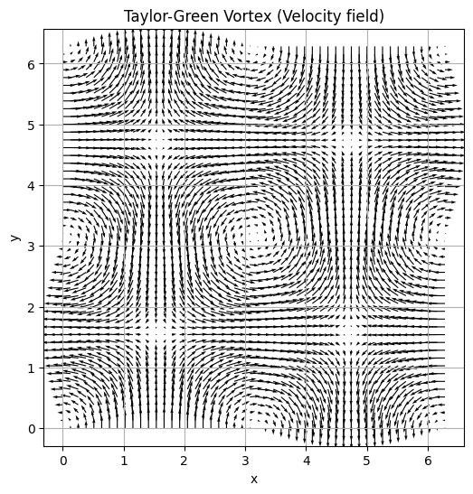
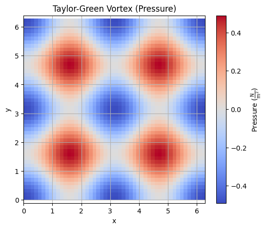
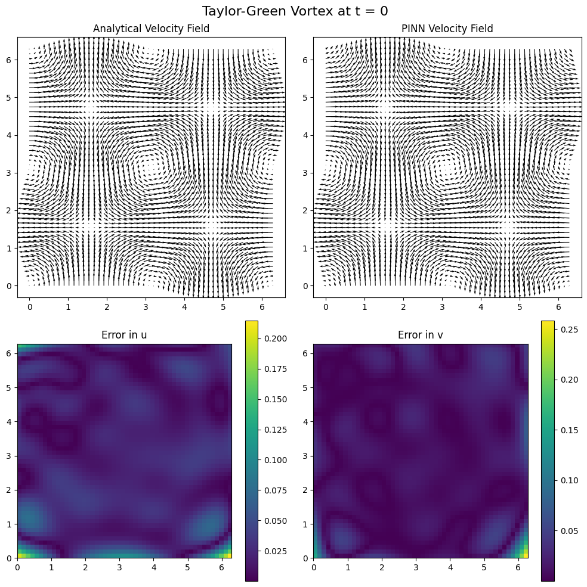
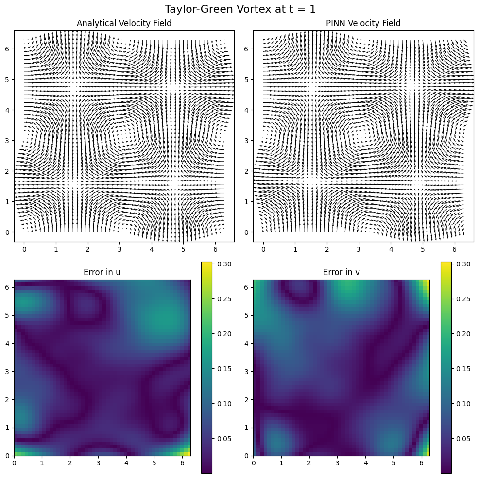

# 🌊 Physics-Informed Neural Networks (PINNs) for 2D Incompressible Navier-Stokes
This notebook demonstrates a simple Physics-Informed Neural Network (PINN) applied to a special case of the 2D incompressible Navier-Stokes equations – the [Taylor-Green vortex](https://en.wikipedia.org/wiki/Taylor–Green_vortex) – which is ideal for benchmarking since it has an analytical solution.

 

A small fully-connected feedforward neural network with 3 hidden layers of 64 neurons and tanh activations is trained to approximate the velocity field (u, v) and pressure p from the inputs (x, y, t). The idea is that the access to data/measurements is limited (e.g. in the notebook we only provide 1000 initial condition data points). Still, the model seems to understand the physical relationship for some amount of time through the physical information that we provide through a special 'regularized' loss.

The important change that PINNs provide is this 'regularized' loss where we make use of the mathematical differential equation correlations. For more information take a look at ['Physics Informed Deep Learning'](https://maziarraissi.github.io/PINNs/).

In a nutshell the loss function combines:
- a data loss based on the initial condition at t = 0
- a physics loss enforcing the Navier-Stokes PDEs and continuity equation via automatic differentiation

The trained model is evaluated against the analytical solution using quiver plots and error maps for u and v, with an interactive slider to visualize the solution over time.

## ⚠️ Disclaimer
There is significant room for improvement. The architecture can be deepened, widened, or adapted to better capture complex dynamics. Optimizing the network structure, training strategy, or loss balancing could lead to further performance gains.

Moreover, the concept of PINNs is not limited to problems with analytical solutions. In future work, I plan to explore more advanced or real-world fluid scenarios governed by Navier-Stokes – even in cases where no closed-form solution exists. Additional experiments and applications will be added to this repository over time.
